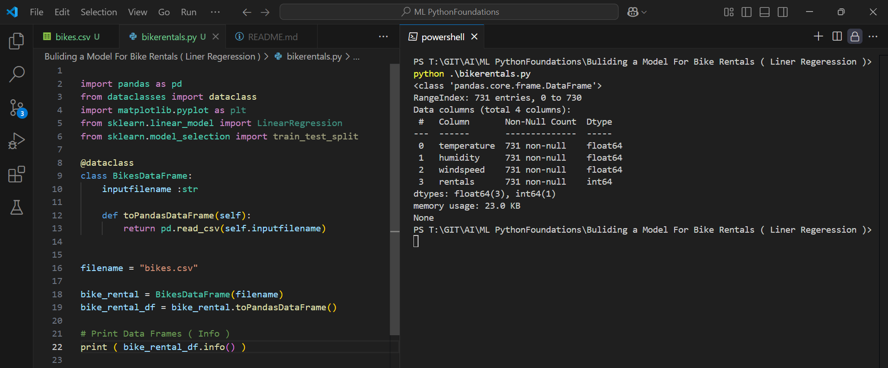
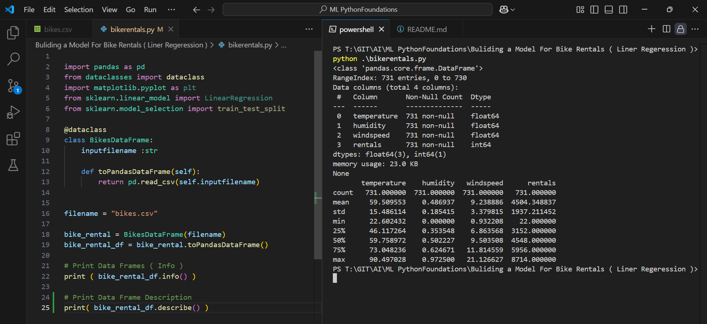
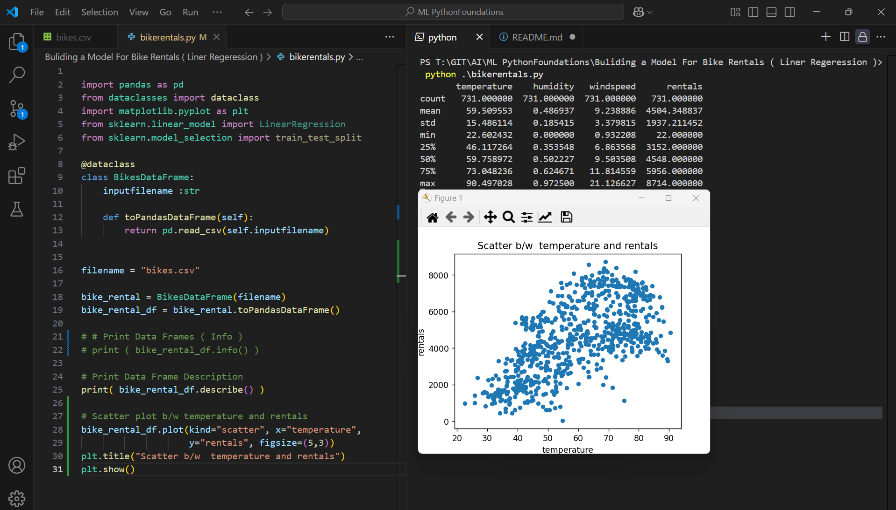
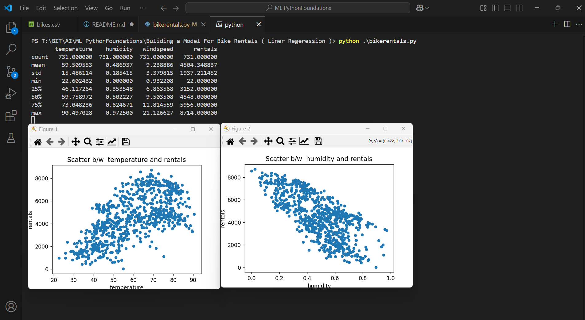

Execution 

```py
import pandas as pd
from dataclasses import dataclass
import matplotlib.pyplot as plt
from sklearn.linear_model import LinearRegression
from sklearn.model_selection import train_test_split

@dataclass
class BikesDataFrame:
    inputfilename :str

    def toPandasDataFrame(self):
        return pd.read_csv(self.inputfilename)
    

filename = "bikes.csv"

bike_rental = BikesDataFrame(filename)
bike_rental_df = bike_rental.toPandasDataFrame()

# Print Data Frames ( Info )
print ( bike_rental_df.info() )

```

Outcome
Print the DataFrame Info


```py
import pandas as pd
from dataclasses import dataclass
import matplotlib.pyplot as plt
from sklearn.linear_model import LinearRegression
from sklearn.model_selection import train_test_split

@dataclass
class BikesDataFrame:
    inputfilename :str

    def toPandasDataFrame(self):
        return pd.read_csv(self.inputfilename)
    

filename = "bikes.csv"

bike_rental = BikesDataFrame(filename)
bike_rental_df = bike_rental.toPandasDataFrame()

# Print Data Frames ( Info )
print ( bike_rental_df.info() )

# Print Data Frame Description
print( bike_rental_df.describe() )

```

Print the DataFrame Description



```py
import pandas as pd
from dataclasses import dataclass
import matplotlib.pyplot as plt
from sklearn.linear_model import LinearRegression
from sklearn.model_selection import train_test_split

@dataclass
class BikesDataFrame:
    inputfilename :str

    def toPandasDataFrame(self):
        return pd.read_csv(self.inputfilename)
    

filename = "bikes.csv"

bike_rental = BikesDataFrame(filename)
bike_rental_df = bike_rental.toPandasDataFrame()

# # Print Data Frames ( Info )
# print ( bike_rental_df.info() )

# Print Data Frame Description
print( bike_rental_df.describe() )

# Scatter plot b/w temperature and rentals
bike_rental_df.plot(kind="scatter", x="temperature",
                    y="rentals", figsize=(5,3))
plt.title("Scatter b/w  temperature and rentals")
plt.show()
```
Outcome
Scatter b/w temperature and rentals



```py
import pandas as pd
from dataclasses import dataclass
import matplotlib.pyplot as plt
from sklearn.linear_model import LinearRegression
from sklearn.model_selection import train_test_split

@dataclass
class BikesDataFrame:
    inputfilename :str

    def toPandasDataFrame(self):
        return pd.read_csv(self.inputfilename)
    

filename = "bikes.csv"

bike_rental = BikesDataFrame(filename)
bike_rental_df = bike_rental.toPandasDataFrame()

# # Print Data Frames ( Info )
# print ( bike_rental_df.info() )

# Print Data Frame Description
print( bike_rental_df.describe() )

# Scatter plot b/w temperature and rentals
bike_rental_df.plot(kind="scatter", x="temperature",
                    y="rentals", figsize=(5,3))
plt.title("Scatter b/w  temperature and rentals")


# Scatter plot b/w humidity and rentals
bike_rental_df.plot(kind="scatter", x="humidity",
                    y="rentals", figsize=(5,3))
plt.title("Scatter b/w  humidity and rentals")
plt.show()
```

Outcome
Scatter b/w temperature and rentals
Scatter b/w humidity and rentals


```py
import pandas as pd
from dataclasses import dataclass
import matplotlib.pyplot as plt
from sklearn.linear_model import LinearRegression
from sklearn.model_selection import train_test_split

@dataclass
class BikesDataFrame:
    inputfilename :str

    def toPandasDataFrame(self):
        return pd.read_csv(self.inputfilename)
    

filename = "bikes.csv"

bike_rental = BikesDataFrame(filename)
bike_rental_df = bike_rental.toPandasDataFrame()

# # Print Data Frames ( Info )
# print ( bike_rental_df.info() )

# Print Data Frame Description
print( bike_rental_df.describe() )

# Scatter plot b/w temperature and rentals
bike_rental_df.plot(kind="scatter", x="temperature",
                    y="rentals", figsize=(5,3))
plt.title("Scatter b/w  temperature and rentals")


# Scatter plot b/w humidity and rentals
bike_rental_df.plot(kind="scatter", x="humidity",
                    y="rentals", figsize=(5,3))
plt.title("Scatter b/w  humidity and rentals")

# Scatter plot b/w windspeed and rentals
bike_rental_df.plot(kind="scatter", x="windspeed",
                    y="rentals", figsize=(5,3))
plt.title("Scatter b/w  windspeed and rentals")
plt.show()

```

Outcome
Scatter b/w temperature and rentals
Scatter b/w humidity and rentals
Scatter b/w windspeed and rentals
