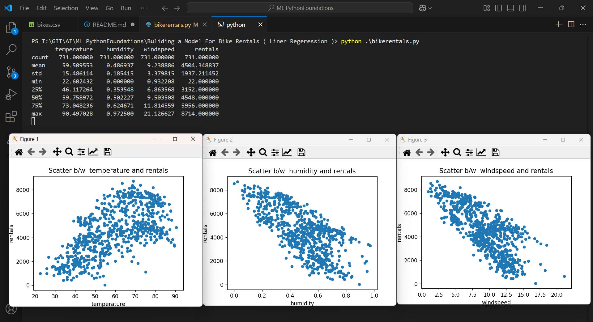

Execution 

```py
import pandas as pd
from dataclasses import dataclass
import matplotlib.pyplot as plt
from sklearn.linear_model import LinearRegression
from sklearn.model_selection import train_test_split

@dataclass
class BikesDataFrame:
    inputfilename :str

    def toPandasDataFrame(self):
        return pd.read_csv(self.inputfilename)
    

filename = "bikes.csv"

bike_rental = BikesDataFrame(filename)
bike_rental_df = bike_rental.toPandasDataFrame()

# Print Data Frames ( Info )
print ( bike_rental_df.info() )

```

Outcome
Print the DataFrame Info


```py
import pandas as pd
from dataclasses import dataclass
import matplotlib.pyplot as plt
from sklearn.linear_model import LinearRegression
from sklearn.model_selection import train_test_split

@dataclass
class BikesDataFrame:
    inputfilename :str

    def toPandasDataFrame(self):
        return pd.read_csv(self.inputfilename)
    

filename = "bikes.csv"

bike_rental = BikesDataFrame(filename)
bike_rental_df = bike_rental.toPandasDataFrame()

# Print Data Frames ( Info )
print ( bike_rental_df.info() )

# Print Data Frame Description
print( bike_rental_df.describe() )

```

Print the DataFrame Description


```py
import pandas as pd
from dataclasses import dataclass
import matplotlib.pyplot as plt
from sklearn.linear_model import LinearRegression
from sklearn.model_selection import train_test_split

@dataclass
class BikesDataFrame:
    inputfilename :str

    def toPandasDataFrame(self):
        return pd.read_csv(self.inputfilename)
    

filename = "bikes.csv"

bike_rental = BikesDataFrame(filename)
bike_rental_df = bike_rental.toPandasDataFrame()

# # Print Data Frames ( Info )
# print ( bike_rental_df.info() )

# Print Data Frame Description
print( bike_rental_df.describe() )

# Scatter plot b/w temperature and rentals
bike_rental_df.plot(kind="scatter", x="temperature",
                    y="rentals", figsize=(5,3))
plt.title("Scatter b/w  temperature and rentals")
plt.show()
```
Outcome
Scatter b/w temperature and rentals


```py
import pandas as pd
from dataclasses import dataclass
import matplotlib.pyplot as plt
from sklearn.linear_model import LinearRegression
from sklearn.model_selection import train_test_split

@dataclass
class BikesDataFrame:
    inputfilename :str

    def toPandasDataFrame(self):
        return pd.read_csv(self.inputfilename)
    

filename = "bikes.csv"

bike_rental = BikesDataFrame(filename)
bike_rental_df = bike_rental.toPandasDataFrame()

# # Print Data Frames ( Info )
# print ( bike_rental_df.info() )

# Print Data Frame Description
print( bike_rental_df.describe() )

# Scatter plot b/w temperature and rentals
bike_rental_df.plot(kind="scatter", x="temperature",
                    y="rentals", figsize=(5,3))
plt.title("Scatter b/w  temperature and rentals")


# Scatter plot b/w humidity and rentals
bike_rental_df.plot(kind="scatter", x="humidity",
                    y="rentals", figsize=(5,3))
plt.title("Scatter b/w  humidity and rentals")
plt.show()
```

Outcome
Scatter b/w temperature and rentals
Scatter b/w humidity and rentals


```py
import pandas as pd
from dataclasses import dataclass
import matplotlib.pyplot as plt
from sklearn.linear_model import LinearRegression
from sklearn.model_selection import train_test_split

@dataclass
class BikesDataFrame:
    inputfilename :str

    def toPandasDataFrame(self):
        return pd.read_csv(self.inputfilename)
    

filename = "bikes.csv"

bike_rental = BikesDataFrame(filename)
bike_rental_df = bike_rental.toPandasDataFrame()

# # Print Data Frames ( Info )
# print ( bike_rental_df.info() )

# Print Data Frame Description
print( bike_rental_df.describe() )

# Scatter plot b/w temperature and rentals
bike_rental_df.plot(kind="scatter", x="temperature",
                    y="rentals", figsize=(5,3))
plt.title("Scatter b/w  temperature and rentals")


# Scatter plot b/w humidity and rentals
bike_rental_df.plot(kind="scatter", x="humidity",
                    y="rentals", figsize=(5,3))
plt.title("Scatter b/w  humidity and rentals")

# Scatter plot b/w windspeed and rentals
bike_rental_df.plot(kind="scatter", x="windspeed",
                    y="rentals", figsize=(5,3))
plt.title("Scatter b/w  windspeed and rentals")
plt.show()

```

Outcome
Scatter b/w temperature and rentals
Scatter b/w humidity and rentals
Scatter b/w windspeed and rentals


```py
import pandas as pd
from dataclasses import dataclass
import matplotlib.pyplot as plt
from sklearn.linear_model import LinearRegression
from sklearn.model_selection import train_test_split

@dataclass
class BikesDataFrame:
    inputfilename :str

    def toPandasDataFrame(self):
        return pd.read_csv(self.inputfilename)
    

filename = "bikes.csv"

bike_rental = BikesDataFrame(filename)
bike_rental_df = bike_rental.toPandasDataFrame()

# # Print Data Frames ( Info )
# print ( bike_rental_df.info() )

# Print Data Frame Description
print( bike_rental_df.describe() )

# # Scatter plot b/w temperature and rentals
# bike_rental_df.plot(kind="scatter", x="temperature",
#                     y="rentals", figsize=(5,3))
# plt.title("Scatter b/w  temperature and rentals")


# # Scatter plot b/w humidity and rentals
# bike_rental_df.plot(kind="scatter", x="humidity",
#                     y="rentals", figsize=(5,3))
# plt.title("Scatter b/w  humidity and rentals")

# # Scatter plot b/w windspeed and rentals
# bike_rental_df.plot(kind="scatter", x="windspeed",
#                     y="rentals", figsize=(5,3))
# plt.title("Scatter b/w  windspeed and rentals")
# plt.show()

# Response ( Output )
response = 'rentals'
y = bike_rental_df[['rentals']]
print("Prediction Parameter : ",response)
print("********Response******\n",y.head(4))

# Predictors ( Input )
predictors = list(bike_rental_df.columns)
predictors.remove(response)
print("Predictors Parameters : ",predictors)
x = bike_rental_df[predictors]
print("********Input******\n",x.head(4))
```
Outcome
Response and Predictor Data Frames


```py
import pandas as pd
from dataclasses import dataclass
import matplotlib.pyplot as plt
from sklearn.linear_model import LinearRegression
from sklearn.model_selection import train_test_split

@dataclass
class BikesDataFrame:
    inputfilename :str

    def toPandasDataFrame(self):
        return pd.read_csv(self.inputfilename)
    

filename = "bikes.csv"

bike_rental = BikesDataFrame(filename)
bike_rental_df = bike_rental.toPandasDataFrame()

# # Print Data Frames ( Info )
# print ( bike_rental_df.info() )

# Print Data Frame Description
print( bike_rental_df.describe() )

# # Scatter plot b/w temperature and rentals
# bike_rental_df.plot(kind="scatter", x="temperature",
#                     y="rentals", figsize=(5,3))
# plt.title("Scatter b/w  temperature and rentals")


# # Scatter plot b/w humidity and rentals
# bike_rental_df.plot(kind="scatter", x="humidity",
#                     y="rentals", figsize=(5,3))
# plt.title("Scatter b/w  humidity and rentals")

# # Scatter plot b/w windspeed and rentals
# bike_rental_df.plot(kind="scatter", x="windspeed",
#                     y="rentals", figsize=(5,3))
# plt.title("Scatter b/w  windspeed and rentals")
# plt.show()

# Response ( Output )
response = 'rentals'
y = bike_rental_df[['rentals']]
print("Prediction Parameter : ",response)
print("********Response******\n",y.head(4))

# Predictors ( Input )
predictors = list(bike_rental_df.columns)
predictors.remove(response)
print("Predictors Parameters : ",predictors)
x = bike_rental_df[predictors]
print("********Input******\n",x.head(4))


# Training Testing Split ( Random + Default Split)
x_train, x_test, y_train, y_test = train_test_split(x,y,random_state=456)
print(f"****Training Testing Split****\n x Train = {x_train.shape}\n x Test  = {x_test.shape}\n y Train = {y_train.shape}\n y Test  = {y_test.shape} ")
```

Outcome
Training Testing Split


```py

import pandas as pd
from dataclasses import dataclass
import matplotlib.pyplot as plt
from sklearn.linear_model import LinearRegression
from sklearn.model_selection import train_test_split

@dataclass
class BikesDataFrame:
    inputfilename :str

    def toPandasDataFrame(self):
        return pd.read_csv(self.inputfilename)
    

filename = "bikes.csv"

bike_rental = BikesDataFrame(filename)
bike_rental_df = bike_rental.toPandasDataFrame()

# # Print Data Frames ( Info )
# print ( bike_rental_df.info() )

# Print Data Frame Description
print( bike_rental_df.describe() )

# # Scatter plot b/w temperature and rentals
# bike_rental_df.plot(kind="scatter", x="temperature",
#                     y="rentals", figsize=(5,3))
# plt.title("Scatter b/w  temperature and rentals")


# # Scatter plot b/w humidity and rentals
# bike_rental_df.plot(kind="scatter", x="humidity",
#                     y="rentals", figsize=(5,3))
# plt.title("Scatter b/w  humidity and rentals")

# # Scatter plot b/w windspeed and rentals
# bike_rental_df.plot(kind="scatter", x="windspeed",
#                     y="rentals", figsize=(5,3))
# plt.title("Scatter b/w  windspeed and rentals")
# plt.show()

# Response ( Output )
response = 'rentals'
y = bike_rental_df[['rentals']]
print("Prediction Parameter : ",response)
print("********Response******\n",y.head(4))

# Predictors ( Input )
predictors = list(bike_rental_df.columns)
predictors.remove(response)
print("Predictors Parameters : ",predictors)
x = bike_rental_df[predictors]
print("********Input******\n",x.head(4))


# Training Testing Split ( Random + Default Split)
x_train, x_test, y_train, y_test = train_test_split(x,y,random_state=456)
print(f"****Training Testing Split****\n x Train = {x_train.shape}\n x Test  = {x_test.shape}\n y Train = {y_train.shape}\n y Test  = {y_test.shape} ")

# Model Training
model = LinearRegression().fit(x_train, y_train)
print(f"***Linear Regressiosn Model****\n Intercept : {model.intercept_}, Coeff : {model.coef_}")

```

Outcome
Model Traning


```py
import pandas as pd
from dataclasses import dataclass
import matplotlib.pyplot as plt
from sklearn.linear_model import LinearRegression
from sklearn.model_selection import train_test_split
from sklearn.metrics import mean_absolute_error

@dataclass
class BikesDataFrame:
    inputfilename :str

    def toPandasDataFrame(self):
        return pd.read_csv(self.inputfilename)
    

filename = "bikes.csv"

bike_rental = BikesDataFrame(filename)
bike_rental_df = bike_rental.toPandasDataFrame()

# # Print Data Frames ( Info )
# print ( bike_rental_df.info() )

# Print Data Frame Description
print( bike_rental_df.describe() )

# # Scatter plot b/w temperature and rentals
# bike_rental_df.plot(kind="scatter", x="temperature",
#                     y="rentals", figsize=(5,3))
# plt.title("Scatter b/w  temperature and rentals")


# # Scatter plot b/w humidity and rentals
# bike_rental_df.plot(kind="scatter", x="humidity",
#                     y="rentals", figsize=(5,3))
# plt.title("Scatter b/w  humidity and rentals")

# # Scatter plot b/w windspeed and rentals
# bike_rental_df.plot(kind="scatter", x="windspeed",
#                     y="rentals", figsize=(5,3))
# plt.title("Scatter b/w  windspeed and rentals")
# plt.show()

# Response ( Output )
response = 'rentals'
y = bike_rental_df[['rentals']]
print("Prediction Parameter : ",response)
print("********Response******\n",y.head(4))

# Predictors ( Input )
predictors = list(bike_rental_df.columns)
predictors.remove(response)
print("Predictors Parameters : ",predictors)
x = bike_rental_df[predictors]
print("********Input******\n",x.head(4))


# Training Testing Split ( Random + Default Split)
x_train, x_test, y_train, y_test = train_test_split(x,y,random_state=456)
print(f"****Training Testing Split****\n x Train = {x_train.shape}\n x Test  = {x_test.shape}\n y Train = {y_train.shape}\n y Test  = {y_test.shape} ")

# Model Training
model = LinearRegression().fit(x_train, y_train)
print(f"***Linear Regressiosn Model****\n Intercept : {model.intercept_}, Coeff : {model.coef_}")

# Model Evaluation
print(f"The Model Prediction Score is ",model.score(x_test, y_test))
y_prediction = model.predict(x_test)
print(f"Mean Absolute Error of the Model is ",mean_absolute_error(y_prediction,y_test))

# Creating Outcome Comparison
y_prediction_df = pd.DataFrame(y_prediction,index= y_test.index, columns=['Rentals_Prediction'])
# print(y_prediction_df.head())
comparison_df = pd.concat([y_test,y_prediction_df],axis=1)
comparison_df["Difference"] = comparison_df["rentals"] - comparison_df["Rentals_Prediction"]
# print(comparison_df.head(6))

print("***********Exact Matches +/- 10 **************")
print(comparison_df[((comparison_df["Difference"]> 0) & (comparison_df["Difference"] < 10)) | 
                    ((comparison_df["Difference"]< 0) & (comparison_df["Difference"] > -10)) ])
print("***********Difference **************")
print(comparison_df["Difference"].describe())
comparison_df["Difference"].plot(kind="hist")
plt.title("Diffence Histogram") 
plt.show()

```

Outcome 
Model Evaluation
