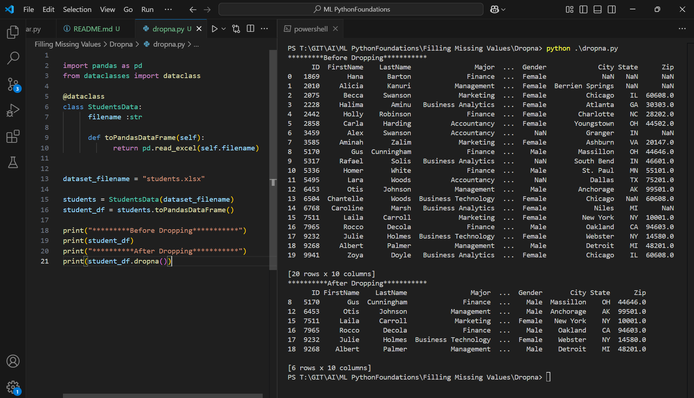

Execute One

```py
import pandas as pd
from dataclasses import dataclass

@dataclass
class StudentsData:
      filename :str

      def toPandasDataFrame(self):
            return pd.read_excel(self.filename)
      

dataset_filename = "students.xlsx"

students = StudentsData(dataset_filename)
student_df = students.toPandasDataFrame()

print("*********Before Dropping***********")
print(student_df)
print("**********After Dropping***********")
print(student_df.dropna())

```

Outcome
