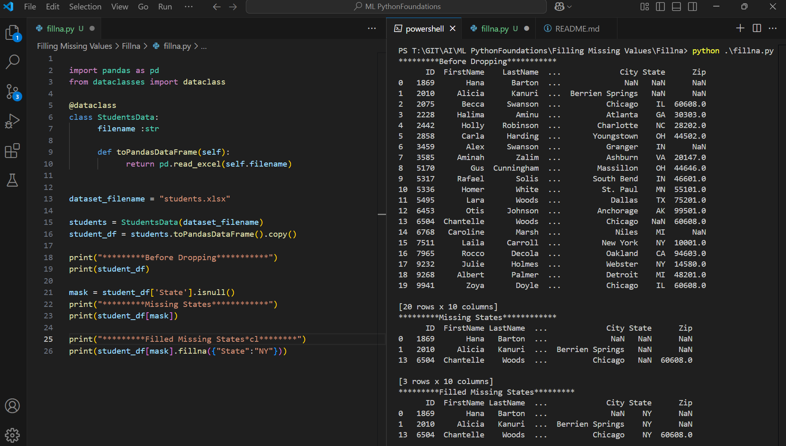
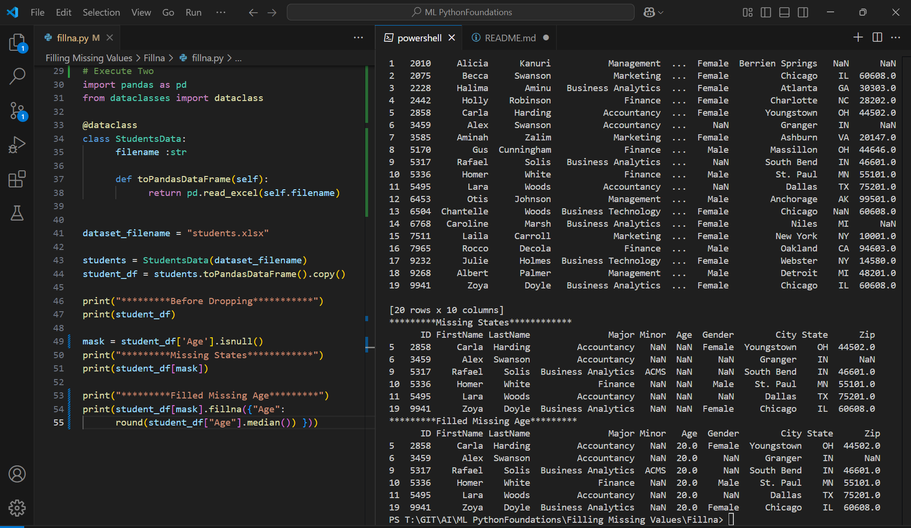

Execute One

```py
import pandas as pd
from dataclasses import dataclass

@dataclass
class StudentsData:
      filename :str

      def toPandasDataFrame(self):
            return pd.read_excel(self.filename)
      

dataset_filename = "students.xlsx"

students = StudentsData(dataset_filename)
student_df = students.toPandasDataFrame().copy()

print("*********Before Dropping***********")
print(student_df)

mask = student_df['State'].isnull()
print("*********Missing States************")
print(student_df[mask])

print("*********Filled Missing States*********")
print(student_df[mask].fillna({"State":"NY"}))
```

Outcome


Execute Two

```py
# Execute Two
import pandas as pd
from dataclasses import dataclass

@dataclass
class StudentsData:
      filename :str

      def toPandasDataFrame(self):
            return pd.read_excel(self.filename)
      

dataset_filename = "students.xlsx"

students = StudentsData(dataset_filename)
student_df = students.toPandasDataFrame().copy()

print("*********Before Dropping***********")
print(student_df)

mask = student_df['Age'].isnull()
print("*********Missing States************")
print(student_df[mask])

print("*********Filled Missing Age*********")
print(student_df[mask].fillna({"Age": 
      round(student_df["Age"].median()) }))
```

Outcome
