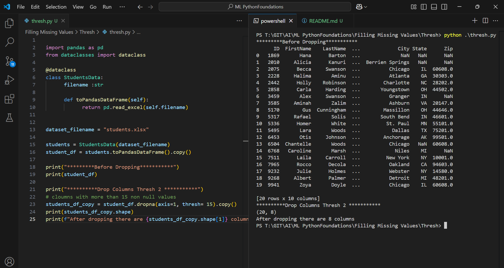

Execute 

```py
import pandas as pd
from dataclasses import dataclass

@dataclass
class StudentsData:
      filename :str

      def toPandasDataFrame(self):
            return pd.read_excel(self.filename)
      

dataset_filename = "students.xlsx"

students = StudentsData(dataset_filename)
student_df = students.toPandasDataFrame().copy()

print("*********Before Dropping***********")
print(student_df)

print("**********Drop Columns Thresh 2 ***********")
# cloumns with more than 15 non null values
students_df_copy = student_df.dropna(axis=1, thresh= 15).copy()
print(students_df_copy.shape)
print(f"After dropping there are {students_df_copy.shape[1]} columns")
```

Outcome
