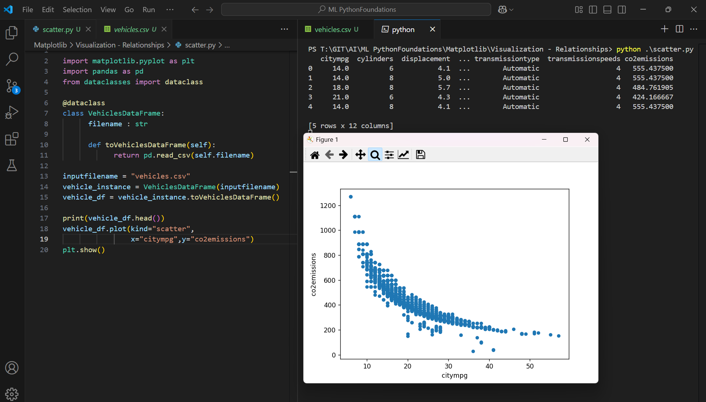
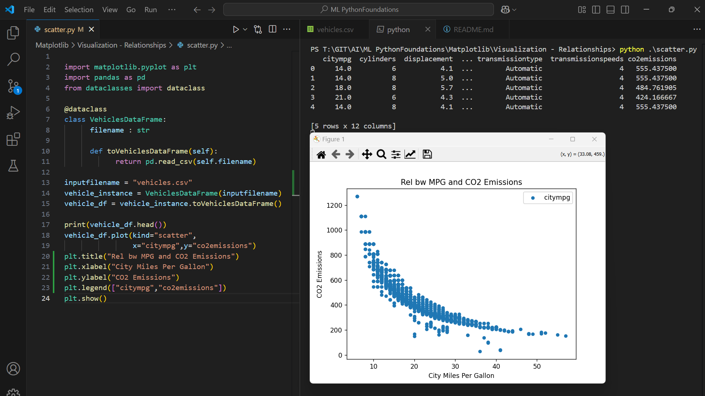

Execute One

```py
import matplotlib.pyplot as plt
import pandas as pd
from dataclasses import dataclass

@dataclass
class VehiclesDataFrame:
      filename : str

      def toVehiclesDataFrame(self):
            return pd.read_csv(self.filename)

inputfilename = "vehicles.csv"
vehicle_instance = VehiclesDataFrame(inputfilename)
vehicle_df = vehicle_instance.toVehiclesDataFrame()

print(vehicle_df.head())
vehicle_df.plot(kind="scatter",
                x="citympg",y="co2emissions")
plt.show()
```

Outcome



Execute Two

```py
import matplotlib.pyplot as plt
import pandas as pd
from dataclasses import dataclass

@dataclass
class VehiclesDataFrame:
      filename : str

      def toVehiclesDataFrame(self):
            return pd.read_csv(self.filename)

inputfilename = "vehicles.csv"
vehicle_instance = VehiclesDataFrame(inputfilename)
vehicle_df = vehicle_instance.toVehiclesDataFrame()

print(vehicle_df.head())
vehicle_df.plot(kind="scatter",
                x="citympg",y="co2emissions")
plt.title("Rel bw MPG and CO2 Emissions")
plt.xlabel("City Miles Per Gallon")
plt.ylabel("CO2 Emissions")
plt.legend(["citympg","co2emissions"])
plt.show()
```

Outcome
