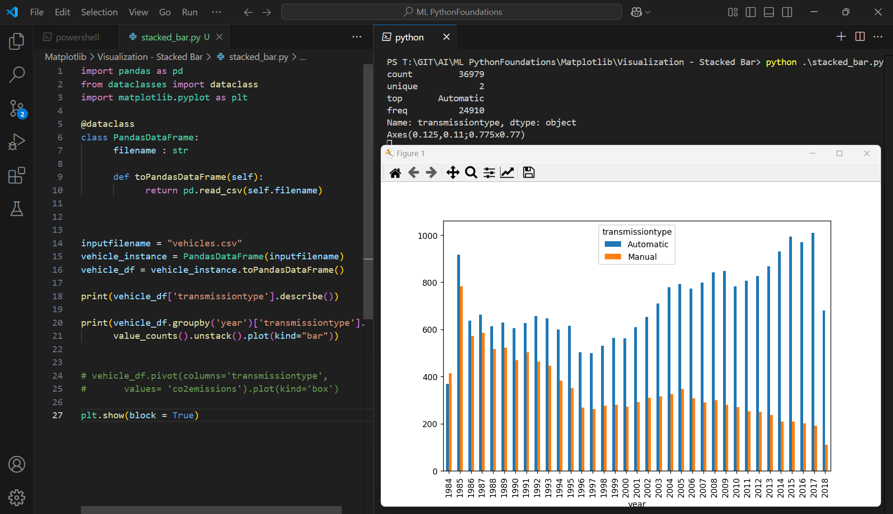

Execute One

```py
import pandas as pd
from dataclasses import dataclass
import matplotlib.pyplot as plt

@dataclass
class PandasDataFrame:
      filename : str

      def toPandasDataFrame(self):
            return pd.read_csv(self.filename)
      


inputfilename = "vehicles.csv"
vehicle_instance = PandasDataFrame(inputfilename)
vehicle_df = vehicle_instance.toPandasDataFrame()

print(vehicle_df['transmissiontype'].describe())

print(vehicle_df.groupby('year')['transmissiontype'].
      value_counts().unstack().plot(kind="bar"))


# vehicle_df.pivot(columns='transmissiontype',
#       values= 'co2emissions').plot(kind='box')

plt.show(block = True)
```

Outcome
