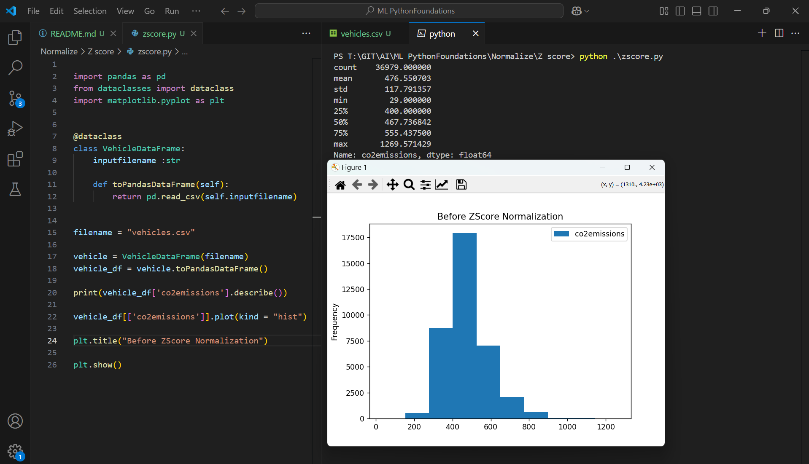

Execute 

```py

import pandas as pd
from dataclasses import dataclass
import matplotlib.pyplot as plt


@dataclass
class VehicleDataFrame:
    inputfilename :str

    def toPandasDataFrame(self):
        return pd.read_csv(self.inputfilename)
    

filename = "vehicles.csv"

vehicle = VehicleDataFrame(filename)
vehicle_df = vehicle.toPandasDataFrame()

print(vehicle_df['co2emissions'].describe())

vehicle_df[['co2emissions']].plot(kind = "hist")

plt.title("Before ZScore Normalization")

plt.show()

```

Outcome
