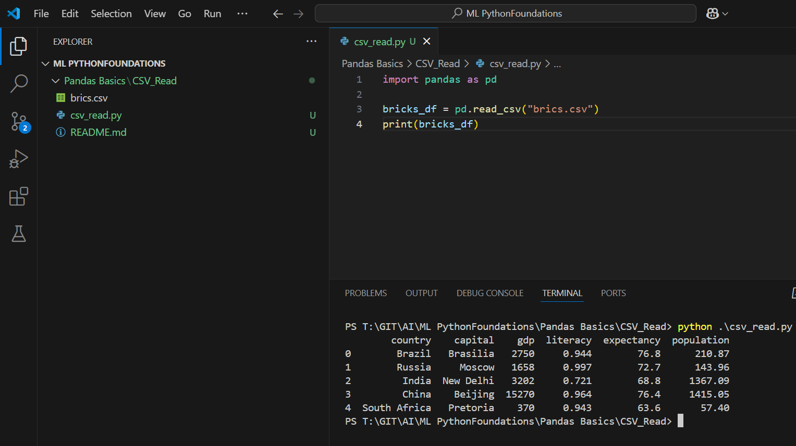
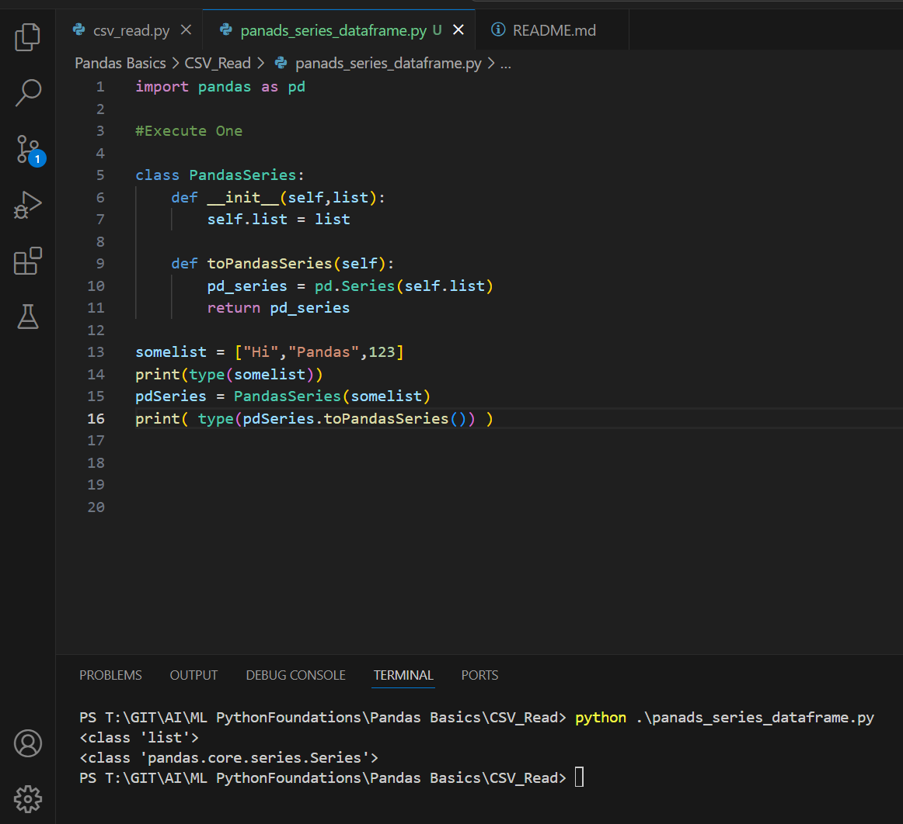
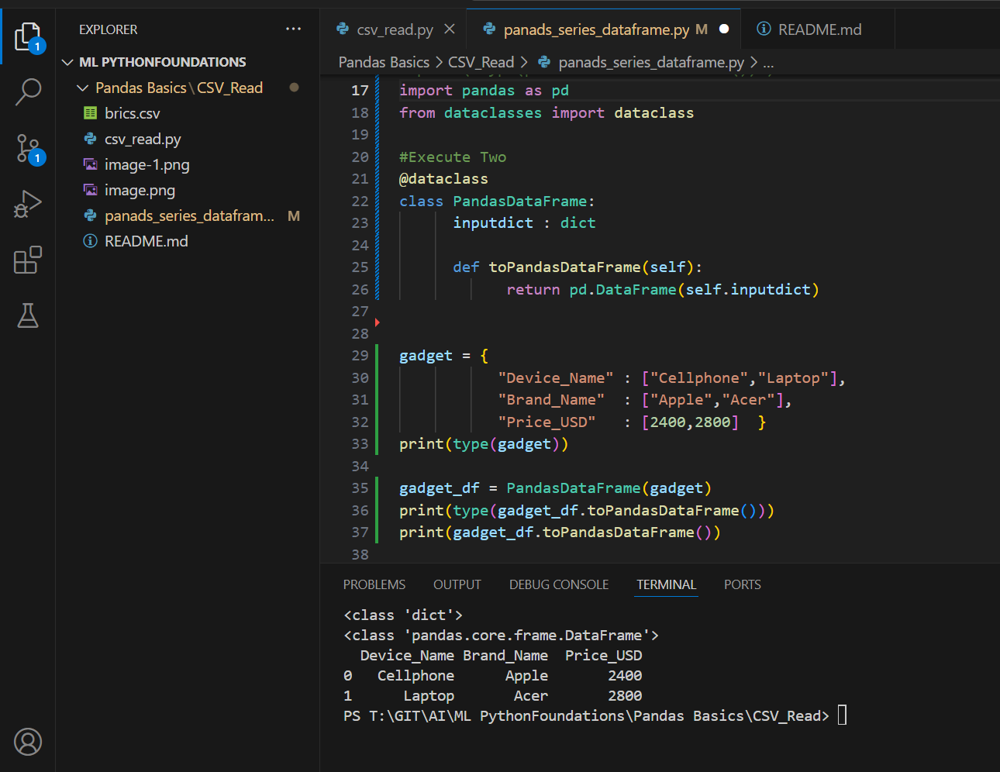

csv_read

Execute One 
```py
import pandas as pd

bricks_df = pd.read_csv("brics.csv")
print(bricks_df)
```
Outcome


____________________________________________________________________________________________________
____________________________________________________________________________________________________

pandas_series_dataframe

Execute One
```py
import pandas as pd

#Execute One

class PandasSeries:
    def __init__(self,list):
        self.list = list
    
    def toPandasSeries(self):
        pd_series = pd.Series(self.list)
        return pd_series

somelist = ["Hi","Pandas",123]
print(type(somelist))
pdSeries = PandasSeries(somelist)
print( type(pdSeries.toPandasSeries()) )

```

Outcome



Execute Two
```py
#Execute Two
@dataclass
class PandasDataFrame:
      inputdict : dict

      def toPandasDataFrame(self):
            return pd.DataFrame(self.inputdict)


gadget = {
           "Device_Name" : ["Cellphone","Laptop"],
           "Brand_Name"  : ["Apple","Acer"],
           "Price_USD"   : [2400,2800]  }
print(type(gadget))

gadget_df = PandasDataFrame(gadget)
print(type(gadget_df.toPandasDataFrame()))
print(gadget_df.toPandasDataFrame())
```
Outcome
