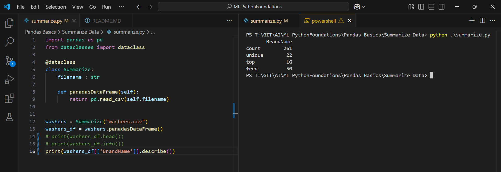

Execute One

```py
import pandas as pd
from dataclasses import dataclass

@dataclass
class Summarize:
    filename : str
    
    def panadasDataFrame(self):
        return pd.read_csv(self.filename)


washers = Summarize("washers.csv")
washers_df = washers.panadasDataFrame()
print(washers_df.head())

```

Outcome


Execute Two

```py
import pandas as pd
from dataclasses import dataclass

@dataclass
class Summarize:
    filename : str
    
    def panadasDataFrame(self):
        return pd.read_csv(self.filename)


washers = Summarize("washers.csv")
washers_df = washers.panadasDataFrame()
#print(washers_df.head())
print(washers_df.info())
```

Outcome


Execute Three

```py
import pandas as pd
from dataclasses import dataclass

@dataclass
class Summarize:
    filename : str
    
    def panadasDataFrame(self):
        return pd.read_csv(self.filename)


washers = Summarize("washers.csv")
washers_df = washers.panadasDataFrame()
# print(washers_df.head())
# print(washers_df.info())
print(washers_df[['BrandName']].describe())
```

Outcome
