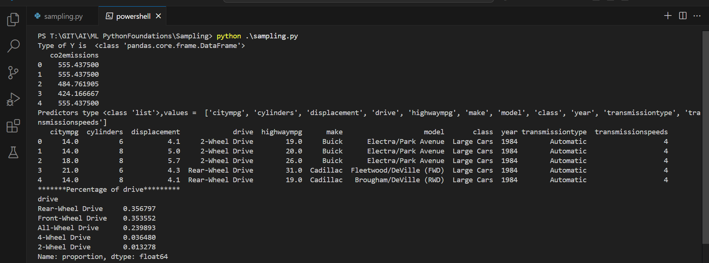
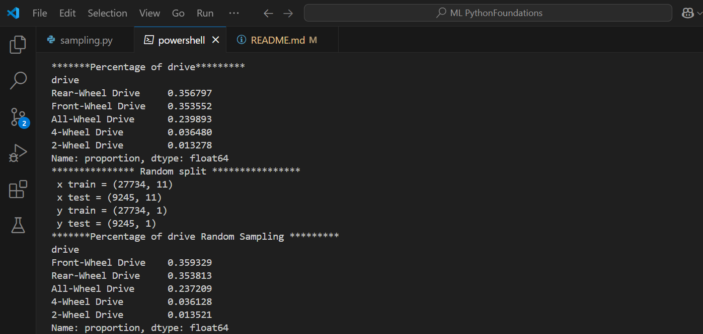
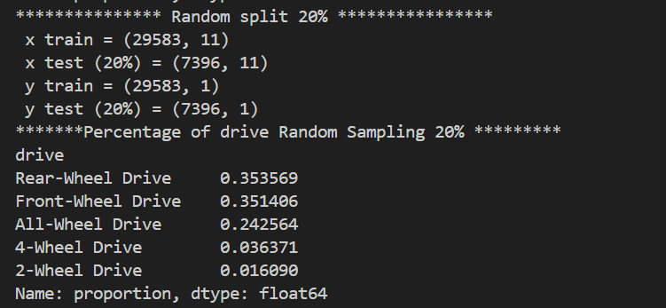
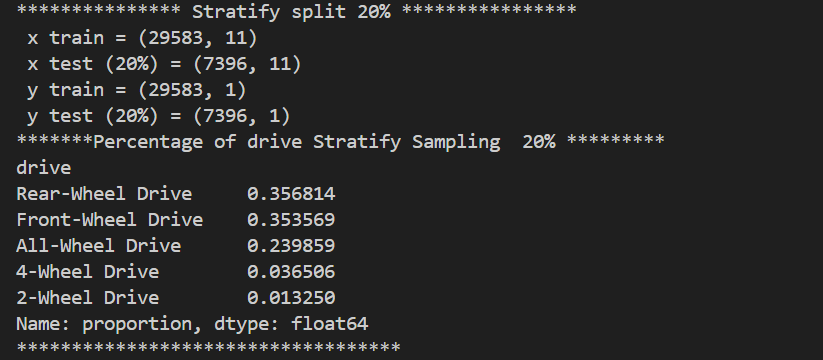

Execute

```py


import pandas as pd
from dataclasses import dataclass
import matplotlib.pyplot as plt
from sklearn.model_selection import train_test_split


@dataclass
class VehicleDataFrame:
    inputfilename :str

    def toPandasDataFrame(self):
        return pd.read_csv(self.inputfilename)
    

filename = "vehicles.csv"

vehicle = VehicleDataFrame(filename)
vehicle_df = vehicle.toPandasDataFrame()

#Response (Outcome)
response = "co2emissions"
y = vehicle_df[[response]]
print("Type of Y is ",type(y))
print(y.head())

#Predictors (Input Parameter)
predictors = list(vehicle_df.columns)
predictors.remove(response)
print(f"Predictors type {type(predictors)},values = ",
      predictors)
x = vehicle_df[predictors]
print(x.head())
print("*******Percentage of drive*********")
print(x['drive'].value_counts(normalize=True))


print("*************** Random split ****************")
# Random Sampling
x_train, x_test, y_train, y_test = train_test_split(x,y)
print(f" x train = {x_train.shape} \n x test = {x_test.shape} \n y train = {y_train.shape} \n y test = {y_test.shape} ")
print("*******Percentage of drive Random Sampling *********")
print(x_test['drive'].value_counts(normalize = True))

print("*************** Random split 20% ****************")
# Random Sampling with constant random state and 20% testing
x_train, x_test, y_train, y_test = train_test_split(x,y,
                                    random_state=456,test_size=0.2)
print(f" x train = {x_train.shape} \n x test (20%) = {x_test.shape} \n y train = {y_train.shape} \n y test (20%) = {y_test.shape} ")
print("*******Percentage of drive Random Sampling 20% *********")
print(x_test['drive'].value_counts(normalize = True))


print("*************** Stratify split 20% ****************")
# Stratify Sampling with constant random state and 20% testing
x_train, x_test, y_train, y_test = train_test_split(x,y,
                stratify= x['drive'], random_state=456,test_size=0.2)
print(f" x train = {x_train.shape} \n x test (20%) = {x_test.shape} \n y train = {y_train.shape} \n y test (20%) = {y_test.shape} ")
print("*******Percentage of drive Stratify Sampling  20% *********")
print(x_test['drive'].value_counts(normalize = True))
print("***********************************")
```

Outcome 
{ X [Drive] }


Random Sampling X Test [Drive]


Random Sampling X Test [Drive] 20%


Stratify Sampling X Test [Drive] 20%
